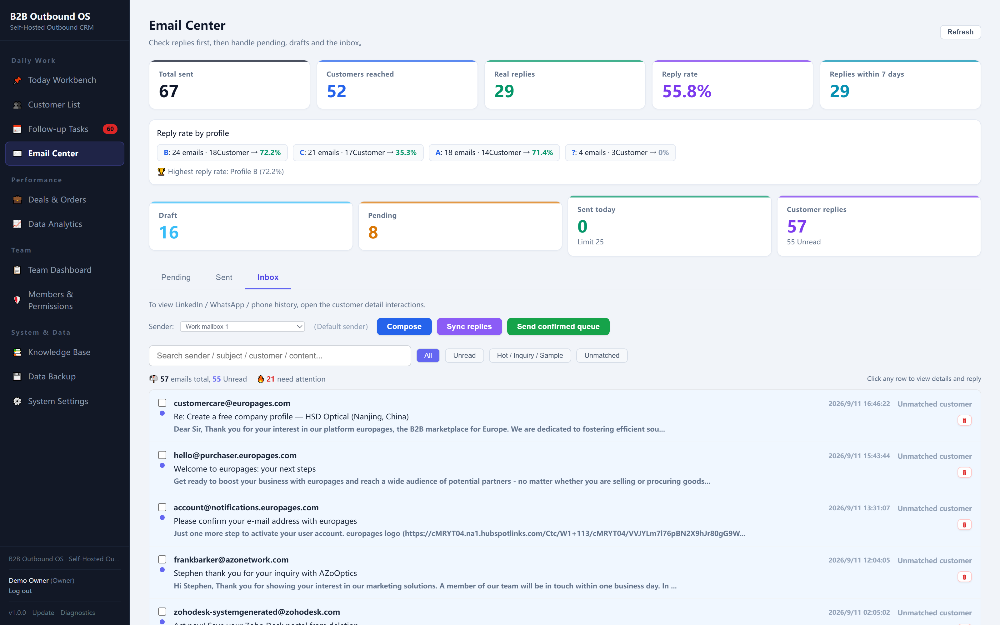
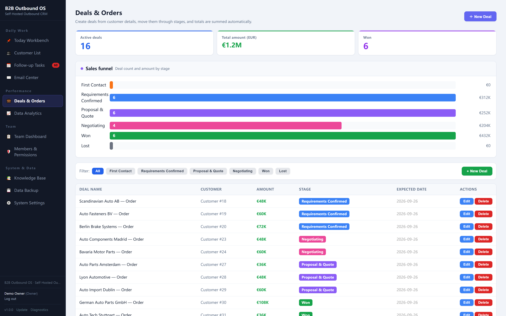
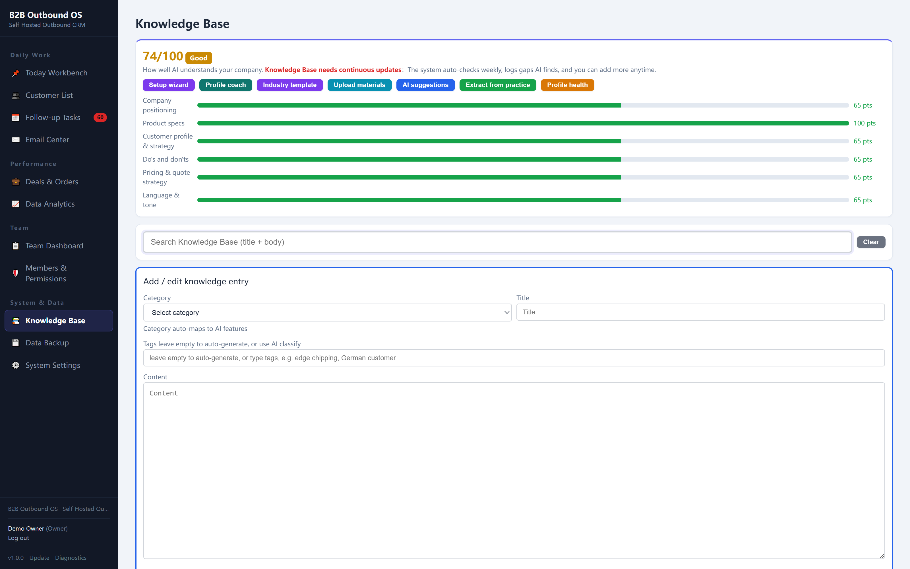
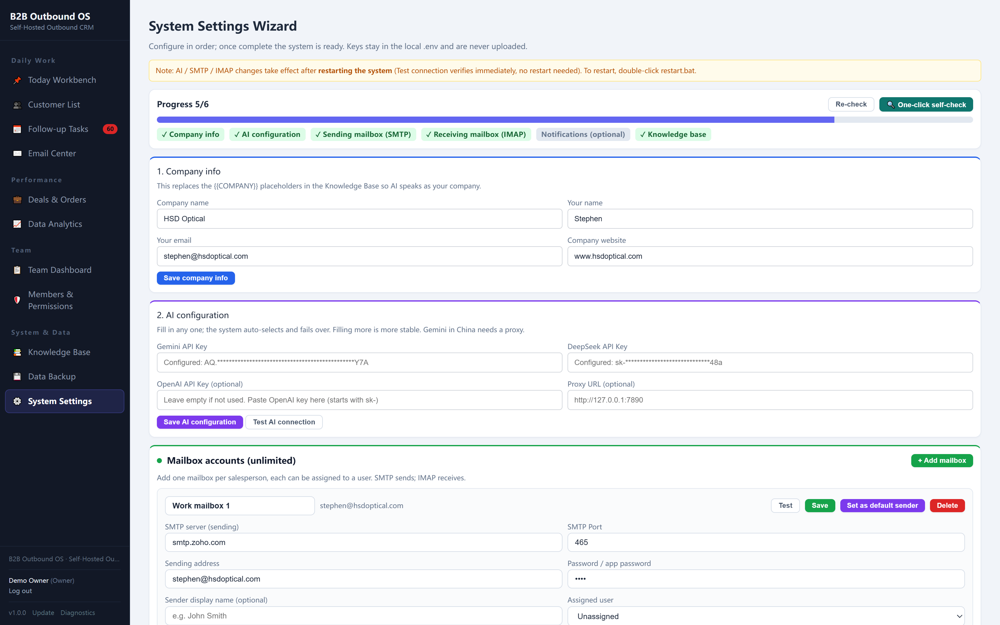

# B2B Outbound OS — Self-Hosted Outbound CRM (Free Demo Build)

> Prospect. Reach. Follow up. Close.

This repository is the **full application source of B2B Outbound OS**, and it
ships with a **sample workspace**, so you can start it and click through a
realistic pipeline in a couple of minutes.

**Demo login:** `demo@demo.com` / `demo123456`
**Live demo (nothing to install):** https://demo.goprospectflow.com/

B2B Outbound OS is a self-hosted CRM for B2B outbound sales development. It turns
a raw customer list into a managed pipeline: AI scoring tells you which customers
deserve your time, research builds context before the first touch, outreach plans
keep every step organized, and an automatic follow-up engine makes sure nobody
falls through the cracks. Email, LinkedIn and WhatsApp are channels you connect —
B2B Outbound OS handles the pipeline, follow-up and deal tracking, while you keep
your own sending accounts and deliverability.

**Not an email blaster.** It is the workflow layer that sits in front of your own
mailboxes and keeps your team moving customers forward.

## What ships in this build

- The complete application (Python + FastAPI, SQLite, no build step)
- A sample workspace: **81 demo companies** across 14 countries, 170+ email
  interactions, 22 deals, 60 scheduled touches and a pre-filled knowledge base
- Five demo users (1 owner + 4 sales reps), so the team dashboard has something
  to show
- One-click installers for Windows / macOS / Linux
- Sample data you can restore at any time from **System Settings → Reset demo data**

No telemetry, no accounts, no subscription. It runs on your machine and your data
never leaves it.

## Add your own AI key to unlock the AI features

The demo starts without any API key, so the AI is off until you switch it on.
Put your own key in **System Settings → AI configuration** (Gemini, DeepSeek or
OpenAI — one is enough), restart, and these start working **on the demo data**:

- AI scoring of every customer (0–100, plus A–E value tiers)
- Customer research: website / LinkedIn / hiring signals
- Cold email and LinkedIn message generation from the built-in skills
- Reply-intent analysis and AI quality checks on drafts
- AI quote extraction and customer-profile coaching

Your key stays in the local `.env` file; the model bills you directly at provider
prices (usually cents per campaign). There is no fee from us and no markup.

## Screenshots

| Today Workbench | Customer List | Follow-up Tasks |
|---|---|---|
|  |  |  |

| Email Center | Deals & Orders | Knowledge Base |
|---|---|---|
|  |  |  |

| Data Analytics | System Settings | |
|---|---|---|
|  |  | |

## Quick start

**Requirements:** Python **3.10** (free) — nothing else.

1. Install Python 3.10 from https://www.python.org/downloads/ and tick
   *"Add python.exe to PATH"* during setup.
2. Download or clone this repository.
3. Windows: double-click `install.bat`, then `start.bat`.
   macOS / Linux: run `bash install_mac.sh`, then `bash start.sh`.
4. Your browser opens on http://localhost:8010 — log in with
   `demo@demo.com` / `demo123456`.

`start.bat` also installs the Python dependencies if you skip `install.bat`.

## What's inside

1. Customer pipeline with AI scoring and value tiers (A–E)
2. Customer research: website, LinkedIn and hiring signals
3. Multi-step outreach plans with decision-chain ordering
4. Follow-up engine with no-reply rules and cooling periods
5. Deals pipeline, sample tracking and quote history
6. Knowledge base that teaches the AI about your business
7. Team dashboard, per-rep daily targets and audit log
8. Email center: drafts, queue, scheduled sending, inbox, bounce detection

## First-time configuration

Open **System Settings** and work through the wizard:

1. **Company info** — name, your name, email, website
2. **AI configuration** — any one of Gemini / DeepSeek / OpenAI
3. **Sending mailbox (SMTP)** — e.g. Gmail with an app password
4. **Receiving mailbox (IMAP)** — same mailbox, used to fetch replies
5. **Knowledge base** — tell the AI what you sell and who you target

AI and mailbox changes take effect after restarting the system.

### Using Gmail

Enable IMAP in Gmail settings and create an app password (2-step verification is
required). Use:

- SMTP server `smtp.gmail.com`, port `465`
- IMAP server `imap.gmail.com`, port `993`

Paste the 16-character app password, not your normal Gmail password.

## Privacy & keys

- No API keys are bundled. You supply your own and pay the provider directly.
- SMTP / IMAP / AI keys live only in the local `.env` file on your machine.
- The app only touches the network when it deliberately sends or receives email,
  or calls the AI provider you configured. No telemetry, nothing phones home.
- The full source is in this repository, so you (or your developer) can read
  exactly what it does before connecting a mailbox or an AI key.

## Demo build vs. commercial license

| | This demo build | Commercial license — USD 99 one-time |
|---|---|---|
| Application source | ✅ | ✅ |
| Sample workspace | ✅ | clean, empty workspace |
| Evaluation and personal use | ✅ | ✅ |
| Production / business use | ❌ needs a license | ✅ |
| Illustrated English setup guide | — | ✅ |
| AI install / update prompts for Codex & Claude Code | — | ✅ |
| Updates for 1 year + setup support | — | ✅ |

One payment, no subscription, no renewal, team seats included.

**Buy the commercial license:** https://crmlokal.gumroad.com/

## License

Business Source License 1.1 (BSL 1.1) — see [LICENSE](LICENSE) for the full text.

In short:

- Free to read, run, modify and evaluate, free for personal or internal
  non-commercial use, and you may redistribute the unmodified build at no charge.
- **Production or commercial use** (running it for a business, reselling it, or
  charging for hosting or setup) requires the one-time **USD 99** commercial
  license: https://crmlokal.gumroad.com/
- On **2030-01-01** this project automatically converts to the
  **Apache License 2.0**.

## FAQ

**Is this really free?**
Yes — this build is free to download, run and evaluate. A commercial license
(USD 99 one-time) is required if you run it in a business.

**Do I need to be technical?**
No. Install Python 3.10, double-click two files, and you are in. The paid version
adds an illustrated guide plus one-prompt installers for Codex / Claude Code.

**Which email providers work?**
Any SMTP/IMAP mailbox: Gmail (app password), Outlook, Zoho, your company mail.

**What does the AI cost?**
You bring your own Gemini / DeepSeek / OpenAI key and pay the provider directly —
usually a few cents per campaign. There are no fees from us.

**Where is my data?**
In a local SQLite database next to the app, on your own machine. Backups are local
too, and can be encrypted.

**Is the demo data real?**
No. Every company, contact and interaction in the sample workspace is fictional
and generated for demonstration.

## Support & contact

- Website: https://goprospectflow.com
- Email: alumipanels@gmail.com
- Questions and bug reports: please open an issue in this repository

## Contributing & changelog

See [CONTRIBUTING.md](CONTRIBUTING.md) and [CHANGELOG.md](CHANGELOG.md).
